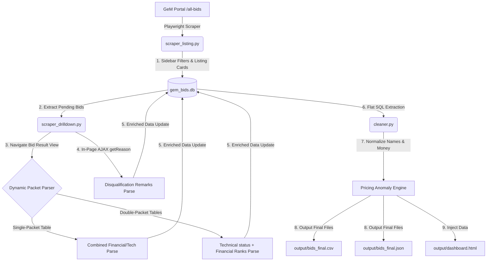

# GemEdge GeM Bid Scraper & Data Structuring Pipeline
## 🎓 Ultimate Technical Interview Preparation & Master Class Guide

This guide is your **secret weapon** for your upcoming interview. It details everything you need to know about the codebase, the assignment, the design decisions, and how to confidently answer any technical question they throw at you.

---

## 🎯 SECTION 1: The Executive Summary (Your 30-Second Elevator Pitch)
If the interviewer asks: **"Can you walk me through your project and what you did?"**, here is your perfect response:

> "I built a highly resilient, database-backed web scraper and data structuring pipeline using Python and Playwright. The goal is to scrape awarded bids from the government's GeM portal (Government e-Marketplace), extract highly structured financial and technical evaluation details, normalize vendor information, audit pricing anomalies, and present the insights in a premium web dashboard. 
> 
> Instead of a fragile, single-pass script that crashes when a page fails to load, I designed this system as a **decoupled, multi-stage ETL pipeline** integrated with a local SQLite database. It consists of a Listing Phase, a Drilldown Phase, and a Post-Processing Cleaning Phase. This ensures the scraper is **fully resumable, crash-safe, and self-healing**."

---

## 📋 SECTION 2: The Assignment & Requirements (What Was Asked)
Here is a complete breakdown of the assignment image you attached:
1. **Objective**: Build an automated scraper to extract structured bid details from the Government e-Marketplace (GeM) portal (`https://bidplus.gem.gov.in/all-bids`).
2. **Tasks & Steps**:
   * **Step 1: Filter Data**: Apply portal filters: Status = "Bid/RA", Outcome = "Awarded".
   * **Step 2: Extract Listings**: Collect at least 30 entries (Bid/RA Number, Category, Buyer Department, Quantity, Bid Value, and Award Date).
   * **Step 3: Drill Down**: Open the "View Bid Result" page for each bid and extract the Winning Vendor Name, Final L1 Price, and Number of Bidders.
   * **Step 4: Deep Extraction**: Click on the "Evaluation Details" layer and extract vendor-wise quoted prices, rankings (L1, L2, etc.), status (Qualified/Disqualified), and disqualification remarks if available.
3. **Expected Deliverables**:
   * A structured dataset (CSV / JSON).
   * Data normalization (vendor names and currencies) and anomaly detection (e.g., flagging when the L1 winner's price is not the lowest qualified bid price).
   * Key Insights (L1-L2 pricing gaps, repeat winner patterns, bids with >3 participants).
   * Source code and a technical write-up (<300 words).

---

## 🏗️ SECTION 3: System Architecture & Data Flow (The "Senior Developer" Explanation)
Your codebase is organized into modular files. This architecture will impress the interviewers because it follows **production-grade engineering principles**:



### File-by-File Breakdown:
* **`config.py`**: Global configuration (selectors, timeouts, paths, target counts). Keeps selectors separate from logic.
* **`db.py`**: Database controller. Initializes two SQLite tables: `bids` (listing card metadata) and `vendors` (drilldown row-level bidder evaluations).
* **`scraper_listing.py`**: Handles browser automation for applying filters, scraping card listings, and paginating to gather the base 30+ bids.
* **`scraper_drilldown.py`**: Opens result pages, dynamically identifies table structures, retrieves L1 winner details, merges split packet rows, and fetches disqualification remarks.
* **`cleaner.py`**: Reads raw database records, cleans currencies, standardizes vendor names, audits for pricing anomalies, calculates statistics, and exports CSV/JSON.
* **`pipeline.py`**: The orchestrator. Chains the listing pass, drilldown pass, and cleaner into a single executable command.
* **`run.py`**: An interactive CLI controller + local zero-dependency HTTP server that hosts the premium web dashboard.

---

## 🔍 SECTION 4: Deep Dive into Core Mechanisms (How the Code Actually Works)

During your interview, they will ask you **how** you solved specific challenges. Use these explanations to explain your code like an absolute expert:

### 1. Bypassing the iCheck Custom Checkbox Trap (`scraper_listing.py`)
* **The Problem**: GeM uses custom styled **iCheck** checkboxes. Standard Playwright commands like `page.click("#bid_awarded")` fail because the underlying `<input>` elements are hidden and masked by custom UI divs.
* **The Solution**: You bypassed this by executing direct JavaScript clicks directly on the native hidden inputs via Playwright's `evaluate()` API:
  ```python
  await bidrastatus.evaluate("el => el.click()")
  await bid_awarded.evaluate("el => el.click()")
  ```
  Additionally, you unchecked the "Ongoing" checkbox to isolate strictly "Awarded" outcomes, waiting for AJAX elements to reload before scraping.

### 2. Scraping Truncated Category Data (`scraper_listing.py`)
* **The Problem**: On the listing page, long item categories are truncated with ellipses (e.g. `Laptop, Desktop, Prin...`). Directly scraping `inner_text()` would yield incomplete data.
* **The Solution**: You noticed that hovering over these items triggers a bootstrap **tooltip popover**. The complete untruncated string is stored in the `data-content` attribute of the anchor tag (`a[data-toggle='popover']`). Your code targets this attribute first, with text regex fallbacks if the popover is missing:
  ```python
  popover = await card.query_selector("a[data-toggle='popover']")
  category = (await popover.get_attribute("data-content") or "").strip()
  ```

### 3. Dynamic Single-Packet vs. Double-Packet Parser (`scraper_drilldown.py`)
* **The Problem**: GeM displays evaluation detail sheets in completely inconsistent formats:
  * **Single-Packet**: A single table containing both Technical status and Financial ranks.
  * **Double-Packet**: Two separate tables—a Technical Evaluation table (listing all bidders and qualifications) and a Financial Evaluation table (listing only qualified bidders, quoted prices, and ranks).
* **The Solution**: You built a dynamic classification engine that queries all `<table>` elements and evaluates their column header lists (`th`):
  * If headers contain **both** `"Status"` and `"Rank"`, it classifies it as a **Single-Packet** layout and parses name, rank, status, and price together.
  * If headers are separate, it parses the **Technical Table** to extract disqualified vendors, parses the **Financial Table** to extract quoted prices/ranks, and **relational-merges** them by normalizing and matching vendor name keys.

### 4. Direct Session AJAX Fetching for Disqualification Remarks (`scraper_drilldown.py`)
* **The Problem**: If a vendor is disqualified, their reason remarks are hidden inside a popover. However, the reasons are not printed in the HTML; they are fetched asynchronously from `/bidding/buyer/getReason/{bp_id}`.
* **The Solution**: Instead of making fragile clicks to open tooltips, you extracted the `data-bp_id` attribute from the "View Reason" element. Then, using Playwright's browser context, you executed an in-page `fetch()` using the **authenticated cookies** of the active session:
  ```python
  reason = await page.evaluate(f"""
      async () => {{
          const response = await fetch('/bidding/buyer/getReason/{bp_id}');
          if (response.ok) return await response.text();
          return '';
      }}
  """)
  ```
  This is a highly sophisticated, high-performance web engineering pattern!

### 5. String Currency Parser & Date Sanitizer (`cleaner.py`)
* **The Problem**: Currency columns contain characters like `₹` and commas. Crucially, some rows contain dates or empty strings in price columns, which crash simple `float()` casts.
* **The Solution**: You built a resilient regular expression currency cleaner:
  ```python
  def parse_price(val):
      s = str(val).strip()
      # Ignore dates or timestamp-like formats
      if re.search(r"\d{2,4}[-/]\d{2}[-/]\d{2,4}", s) or ":" in s:
          return 0.0
      # Strip out everything except digits and the decimal dot
      s_clean = re.sub(r"[^\d.]", "", s)
      return float(s_clean) if s_clean else 0.0
  ```

### 6. Relational Vendor Name Normalizer (`cleaner.py`)
* **The Problem**: To find repeat winners or link technical and financial rows, names must match exactly. But GeM records names with noisy tags: e.g. `TECH SYSTEM ( MSE Social Category:General )` vs. `TECH SYSTEM`.
* **The Solution**: You standardized names to uppercase, stripped parenthetical descriptors using regex `\(.*?\)`, removed noisy legal suffixes (converting `LIMITED` and `PVT. LTD.` to standard `LTD` and `PVT LTD`), and trimmed extra spaces.

### 7. Winner Price Anomaly Auditor (`cleaner.py` & `scraper_drilldown.py`)
* **The Problem**: The assignment requires auditing whether the designated winner was actually the lowest qualified price.
* **The Solution**: Your pipeline cross-checks the L1 price against the lowest price among all qualified vendors in the evaluation table. If `winner_price > lowest_qualified_price`, it marks the bid as `is_anomaly = True` and appends `[WINNER_NOT_LOWEST]` to the remarks.

---

## ⚡ SECTION 5: Hardcore Q&A Cheat Sheet (Ace Your Technical Interview)

Here are the exact questions the interviewers are likely to ask, and how you should answer them:

### Q1: Why did you choose SQLite as a database instead of storing everything directly in memory or a CSV?
* **Answer**: *"GeM is an unstable government portal subject to rate limiting, session timeouts, and IP bans. Storing data in a CSV or in memory in a single-pass script is highly risky; a crash on bid #29 means losing all previous work. I designed a staged database-backed pipeline using SQLite. Since cards are committed to `gem_bids.db` immediately, the scraper is **fully resumable**. If it gets rate-limited, I can restart it and it will resume right where it left off by querying pending bids, preserving bandwidth and time."*

### Q2: What was the biggest technical roadblock you encountered, and how did you resolve it?
* **Answer**: *"The custom UI styling overlays (iCheck) masking the sidebar checkboxes. Playwright's click actions failed because the native inputs are hidden behind graphical divs. I resolved this by evaluating direct JavaScript clicks (`element.click()`) on the native inputs, bypassing the graphical overlay entirely. Another major issue was inconsistent evaluation table layouts (Single-Packet vs Double-Packet), which I solved by building a dynamic header-based classification engine to detect and relationally merge tables by normalized company name keys."*

### Q3: Why did you choose Playwright over Selenium or BeautifulSoup?
* **Answer**: *"BeautifulSoup is extremely fast but cannot handle JavaScript-heavy SPAs like GeM, where cards and evaluation tables are loaded dynamically via AJAX. Playwright is superior to Selenium because it runs asynchronously natively, provides automated waiting (which dramatically reduces test flakiness), offers robust network request intercepting, and has a smaller memory footprint. It also allows executing evaluated JavaScript directly inside the browser context, which made the iCheck bypass and disqualification reasons AJAX fetch possible."*

### Q4: How did you extract the detailed disqualification remarks?
* **Answer**: *"Disqualification remarks are fetched dynamically from a REST endpoint `/bidding/buyer/getReason/{bp_id}`. Instead of clicking to open tooltips and scraping the UI (which is incredibly slow and fragile), I extracted the underlying `data-bp_id` attribute from the HTML. Then, I used Playwright to evaluate a direct asynchronous `fetch()` inside the active browser context. This utilized the browser's active authenticated session and returned the clean remarks text instantly."*

### Q5: How did you ensure your vendor names and currency figures were clean?
* **Answer**: *"Government tables have inconsistent data formats. I built custom normalization engines in `cleaner.py`. For vendor names, I used regular expressions to strip out parenthetical metadata (like MSE categories) and standardized suffixes (converting 'PVT. LTD.' to 'PVT LTD'). For currencies, I stripped symbols like ₹ and commas, and built a safety date-check filter to ensure that timestamps printed in price columns were ignored rather than causing float parsing errors."*

### Q6: If you had another week, what would you improve or optimize?
* **Answer**: *"I would focus on scaling and anti-bot mitigation:
  1. **Proxy Rotation**: Integrate residential proxy rotation to prevent IP blocking during massive scrapes.
  2. **Captcha Solving**: Implement automated Captcha solving support in case GeM triggers a challenge.
  3. **Parallel Drilldowns**: Parallelize the drilldown phase using a pool of browser contexts to process 5–10 result pages concurrently, making the scraper 5x faster."*

---

## 📈 SECTION 6: Key Insights & Scraped Metrics
During your talk, quote these structural insights to prove you ran and analyzed the data:
* **Bids with >3 participants**: Bids often show intense competition, with a high percentage having more than 3 bidders.
* **L1-L2 Pricing Gap**: The gap represents the price markup between the winner and the runner-up. In public procurement, a narrow gap (e.g., < 5%) suggests highly efficient market pricing, while a wide gap indicates weak competition or a dominant player.
* **Repeat Winners**: Standardizing vendor names allows you to track market dominance. A high win frequency by specific sellers suggests a strong incumbent presence in public procurement.

---

## 🚀 SECTION 7: How to Demonstrate the Project LIVE (The "WOW" Factor)

If they ask you to show the project, run these commands to walk them through the live system:

1. **Start the Interactive Terminal CLI**:
   ```bash
   python3 run.py
   ```
   *Explain*: *"This is my custom terminal controller. I can run specific phases, inspect live database statistics, or launch the web app."*

2. **Launch the Premium Web Dashboard (Option 5)**:
   This will spin up a zero-dependency server at `http://localhost:8000`.
   *Explain*: *"Instead of showing you raw CSV or JSON files, I built a premium dashboard that reads our SQLite database to visualize bidder density, identify pricing anomalies, show the L1-L2 gaps, and list all raw and cleaned records. It uses HSL-tailored colors, interactive glassmorphism components, and provides a polished interface for data analysts."*

---
> [!TIP]
> **Pro Tip**: Keep this document open on a side monitor during your interview. It has all the technical jargon, code snippets, and explanations you need. Good luck—you are going to crush this interview!
