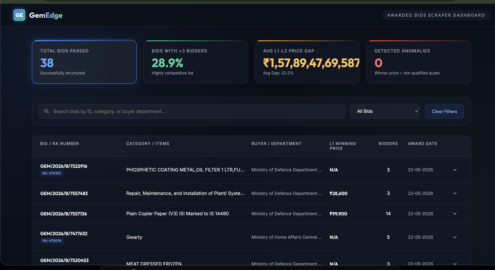

# GemEdge — GeM Bid Scraper & Data Structuring Pipeline

Automated Playwright pipeline that scrapes awarded bids from GeM, drills into evaluation tables, normalizes vendor data, and generates CSV/JSON outputs plus a lightweight dashboard.



---

## The Story

I started with a simple question: how do I make a scraper that can survive the GeM portal on a bad day? Pages are dynamic, the DOM is inconsistent, and results can fail to load. A single-pass script would collapse under real-world behavior, so I built a resumable, staged pipeline instead.

The process is split into three deliberate phases:

1) Listing pass
   - Apply Awarded filters.
   - Paginate listing cards.
   - Store minimal bid metadata + result URLs in SQLite.

2) Drilldown pass
   - Open each result page.
   - Detect Single vs Double Packet tables by header patterns.
   - Merge technical and financial rows and fetch disqualification remarks.

3) Cleaning + outputs
   - Normalize vendor names.
   - Parse currency into numeric values.
   - Flag anomalies (winner price > lowest qualified quote).
   - Export clean CSV/JSON and refresh the dashboard data.

---

## Quick Start

1) Install dependencies
```bash
pip install -r requirements.txt
playwright install chromium
```

2) Run full pipeline
```bash
python pipeline.py
```

3) Outputs
- output/bids_final.csv
- output/bids_final.json
- gem_bids.db

---

## What This Project Delivers

- Awarded bid listing extraction with resilient pagination.
- Result drilldowns with dynamic table detection.
- Disqualification remarks via in-page AJAX.
- Cleaned datasets plus summary stats.
- Optional local dashboard for quick review.

---

## What Broke and How It Was Fixed

- Awarded filters did not respond to standard checkbox actions. Fixed by direct JS clicks and explicit Ongoing uncheck.
- Pagination selectors changed across pages. Added selector fallbacks and scroll-into-view before clicking.
- Result pages vary in layout. Implemented header-based Single vs Double Packet detection.
- Some result pages redirect/abort. Errors are logged and marked without stopping the run.

---

## Key Files (Why They Matter)

- config.py: selectors, timeouts, run settings.
- db.py: SQLite schema + persistence helpers.
- scraper_listing.py: filters + listing extraction.
- scraper_drilldown.py: result parsing + evaluation merging.
- cleaner.py: normalization, anomaly detection, exports.
- pipeline.py: orchestrates the full pipeline.
- run.py: interactive CLI + local dashboard server.

---

## Run Options

- Full pipeline
```bash
python pipeline.py
```

- Force listing pass (fresh pagination test)
```bash
python pipeline.py --force-listing
```

- Drilldown only
```bash
python pipeline.py --drilldown-only
```

- Listing only
```bash
python pipeline.py --listing-only
```

- Interactive menu
```bash
python run.py
```

---

## Outputs

- output/bids_final.csv (flat table)
- output/bids_final.json (nested by bid)
- gem_bids.db (SQLite state)
- logs/scraper.log

---

## Files to Submit

- Source: config.py, db.py, scraper_listing.py, scraper_drilldown.py, cleaner.py, pipeline.py, run.py
- Outputs: output/bids_final.csv, output/bids_final.json, gem_bids.db
- Report: REPORT.txt
