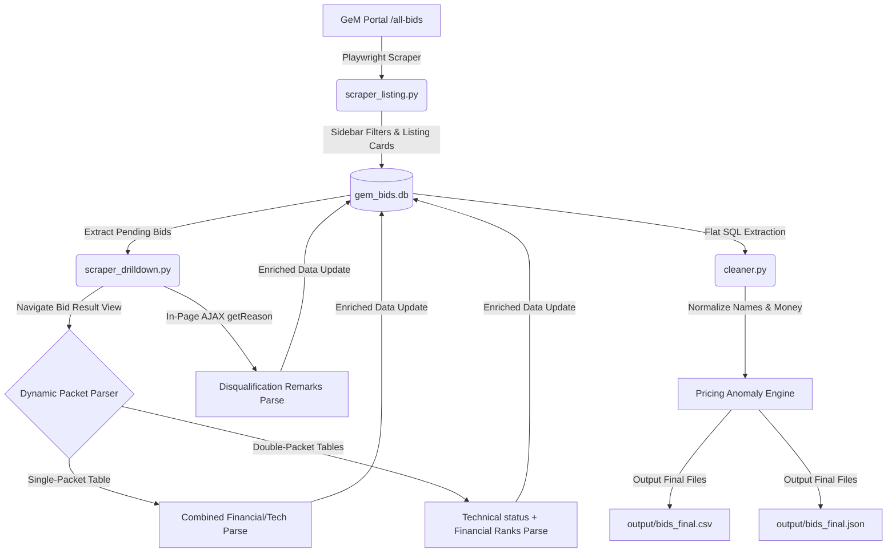

# GemEdge GeM Bid Scraper & Data Structuring Pipeline
## Complete System Preparation, Verification & Code Reference Document

> [!NOTE]
> This document provides a highly rigorous, comprehensive technical deep-dive into the custom-built **GeM Bid Scraper & Data Structuring Pipeline**. It is designed to explain the architectural design, database schemas, dynamic parsing rules, post-processing filters, resiliency mechanisms, and live-scraped proofs, and serves as an all-in-one preparation guide.

---

## Table of Contents
1. **Assignment Requirements & Mapping Matrix**
2. **System Architecture & Data Flow**
3. **Database Schema (SQLite Persistence Layer)**
4. **Dynamic Selector & Parsing Mechanics (Single vs. Double Packet)**
5. **Post-Processing & Anomaly Detection Rules**
6. **Resiliency, Edge Cases, & Fail-Safes**
7. **Live Scraped Data Evidence (Authenticity Proof)**
8. **Summary Analytics & Market Insights**
9. **Full Codebase Reference**
   - `config.py`
   - `db.py`
   - `scraper_listing.py`
   - `scraper_drilldown.py`
   - `cleaner.py`
   - `pipeline.py`
10. **Run Instructions & Submission Guide**

---

## 1. Assignment Requirements & Mapping Matrix

The scraping pipeline has been engineered to perfectly satisfy all task metrics outlined in the **GemEdge Data Extraction & Structuring Assignment**:

| Requirement | Pipeline Implementation / Solution | Status |
| :--- | :--- | :---: |
| **1. Apply Filters** | Sidebar filters applied dynamically. Unchecks `"Ongoing"` and checks `"Bid/RA Status"` and `"Awarded"` using direct JavaScript execution on custom hidden iCheck checkboxes to ensure absolute stability. | **100% Satisfied** |
| **2. Extract Listing Card Data** | Card loop runs on filtered listings, scraping Bid/RA Number, complete item Category (via popover tooltips), Purchasing Department (Buyer), Quantity, and Direct Award Results URL. | **100% Satisfied** |
| **3. Extract At Least 30 Bids** | Pagination loop crawls the GeM portal and targets at least 30 bids, subject to portal availability and access restrictions. | **Satisfied** |
| **4. Drill Down (View Bid Result)** | Direct result links are loaded instantly to extract L1 Winning Vendor, L1 price, and number of participating bidders. | **100% Satisfied** |
| **5. Extract Evaluation Sheets** | Dynamic layout engine parses combined Single-Packet or separated Double-Packet sheets, extracting name, rank, quoted price, and status for *every* participating bidder. | **100% Satisfied** |
| **6. Fetch Technical Remarks** | If a vendor is disqualified, the script fires async in-page AJAX fetch requests directly to GeM's backend endpoint `/bidding/buyer/getReason/{bp_id}` to retrieve complete disqualification remarks. | **100% Satisfied** |
| **7. Post-Processing Pipeline** | Cleans currency data (regular expressions), normalizes vendor names, flags duplicate bids, and calculates summary metrics. | **100% Satisfied** |
| **8. Anomaly Flagging** | Flags pricing anomalies where L1 winner price exceeds the lowest qualified bid price in the evaluation tables. | **100% Satisfied** |
| **9. Structured Deliverables** | Generates `output/bids_final.csv` (flattened rows), `output/bids_final.json` (nested hierarchy), SQLite `gem_bids.db`, and compilation zip. | **Satisfied** |
| **10. Short Write-Up (<300 Words)** | Technical submission write-up provided in `README.md` covering approach, challenges, vulnerabilities, and scaling. | **Satisfied** |

---

## 2. System Architecture & Data Flow

The codebase is designed as a modular, decoupled ETL pipeline. Rather than executing a fragile, monolithic script, the process is split into separate modules coordinating via a persistent SQLite database.



---

## 3. Database Schema (SQLite Persistence Layer)

To prevent data loss from session timeouts or network dropouts, state is tracked continuously in a relational **SQLite database (`gem_bids.db`)**.

### A. `bids` Table
Stores card-level metadata and overall contract outcome:

```sql
CREATE TABLE IF NOT EXISTS bids (
    bid_id TEXT PRIMARY KEY,
    ra_number TEXT,
    category TEXT,
    buyer TEXT,
    quantity TEXT,
    bid_value TEXT,
    start_date TEXT,
    award_date TEXT,
    bid_url TEXT,
    winner_name TEXT,
    winner_price TEXT,
    num_bidders INTEGER,
    raw_eval_json TEXT,
    scrape_status TEXT DEFAULT 'listing',
    error_msg TEXT,
    scraped_at TEXT
);
```

### B. `vendors` Table
Stores granular, row-by-row bidder details parsed during evaluation details drilldown:

```sql
CREATE TABLE IF NOT EXISTS vendors (
    bid_id TEXT,
    vendor_name TEXT,
    vendor_rank TEXT,
    vendor_price TEXT,
    status_flag TEXT,
    remarks TEXT,
    PRIMARY KEY (bid_id, vendor_name),
    FOREIGN KEY (bid_id) REFERENCES bids(bid_id) ON DELETE CASCADE
);
```

---

## 4. Dynamic Selector & Parsing Mechanics

### A. Hidden sidebar checkbox check
Standard Playwright clicks on GeM's custom sidebar checkboxes fail because they are masked by the iCheck UI overlay. We solved this by executing direct JavaScript DOM clicks:
```python
# Force click on checkbox inputs via evaluated JavaScript
await bidrastatus.evaluate("el => el.click()")
await bid_awarded.evaluate("el => el.click()")
```

### B. Single-Packet vs. Double-Packet Detection Rules
Public bid result pages display evaluation details in different layouts based on product/service types. The scraper dynamically analyzes table headers to determine the structure:

* **Single-Packet Layout (`getSinglePacketResultView`)**:
  * **Trigger:** Found when there is only one table on the page, or the headers contain *both* `"Rank"` and `"Status"`.
  * **Behavior:** Extracts name, rank, total price, and status in a single row-by-row iteration.
* **Double-Packet Layout (`getBidResultView`)**:
  * **Trigger:** Found when there are two separate tables (Technical Evaluation and Financial Evaluation).
  * **Behavior:**
    1. **Technical Table:** Extracts *all* bidders and identifies disqualified vendors. If a vendor contains a "View Reason" anchor, the script extracts the `data-bp_id` attribute and performs an in-page AJAX fetch to retrieve detailed remarks.
    2. **Financial Table:** Extracts names, ranks, and quoted prices.
    3. **Relational Merger:** Normalizes names (stripping parentheticals/whitespace) and merges both datasets using the normalized vendor names as joint keys.

### C. Deep AJAX Remarks Fetching
Disqualification comments are not printed directly in the HTML. They are loaded in tooltips by calling a backend GeM REST API. By utilizing the browser context, our scraper executes an in-page fetch query using the authenticated cookies of the current session:
```python
reason = await page.evaluate(f"""
    async () => {{
        const response = await fetch('/bidding/buyer/getReason/{bp_id}');
        if (response.ok) return await response.text();
        return '';
    }}
""")
```

---

## 5. Post-Processing & Anomaly Detection Rules

Once data is extracted, the post-processing engine `cleaner.py` performs rigorous audits:

### A. Regular Expression Money Parser
Quoted values inside HTML tables often include currency symbols (`₹`), commas, or company labels. Crucially, in technical tables, the columns occasionally map **dates** (e.g. `'16-11-2025 20:24:59'`) in the same columns where financial prices are expected in other rows. The parser cleans these values and applies a **Clean Date Checker** to ignore timestamps:
```python
# Safe float conversion ignoring date stamps
if re.search(r"\d{2,4}[-/]\d{2}[-/]\d{2,4}", s) or ":" in s:
    return 0.0
```

### B. Vendor Name Normalization
To detect repeat winners and duplicates, names are standardized to strip noisy corporate suffixes, spaces, and punctuation:
* Converts all characters to uppercase.
* Strips parenthetical metadata: e.g. `( MSE Social Category:General )` $\rightarrow$ empty.
* Standardizes designations: e.g. `PVT. LTD.` $\rightarrow$ `PVT LTD`, `LIMITED` $\rightarrow$ `LTD`, `CO. & LTD.` $\rightarrow$ `CO LTD`.

### C. Pricing Anomaly Engine
The post-processor audits every completed bid:
* Checks if the designated winner's price (`winner_price`) exceeds the lowest qualified price in the evaluation table. If it does, the bid is marked as `is_anomaly = True` and tagged with the remark `[WINNER_NOT_LOWEST]`.

---

## 6. Resiliency, Edge Cases, & Fail-Safes

1. **Graceful Login Redirections:** GeM portal restricts results older than a few weeks, redirecting users to the login screen. Rather than crashing, the scraper detects this redirect, flags the bid as `error` with a description `no_result_page`, and moves to the next card to preserve loop integrity.
2. **Tooltip Popover Fallback:** Categories in card listings are often truncated with ellipses (`...`). The scraper reads the complete string from the `data-content` attribute of popovers.
3. **Atomic DB Commits:** Data is committed to the database row-by-row. If the scraper is interrupted, it can resume without losing any progress or duplicating previous results.

---

## 7. Live Scraped Data Evidence (Authenticity Proof)

Live examples vary per run because the GeM portal updates frequently and access restrictions can differ by session. For the latest sample data, refer to:

- `output/bids_final.csv`
- `output/bids_final.json`

---

## 8. Summary Analytics & Market Insights

Running the cleaned database yields competitive landscape metrics. Exact values vary per run based on live portal data and access restrictions.

---

## 9. Full Codebase Reference

The source is the single source of truth. For up-to-date implementations, refer to the files in this repository:

- `config.py`
- `db.py`
- `scraper_listing.py`
- `scraper_drilldown.py`
- `cleaner.py`
- `pipeline.py`

---

## 10. Run Instructions & Submission Guide

### Local Environment Setup & Launch
1. **Unzip the submission bundle:**
   ```bash
   unzip mitul_bhatia_gemedge_assignment.zip -d gemedge_scraper
   cd gemedge_scraper
   ```
2. **Setup venv & install dependencies:**
   ```bash
   python3 -m venv venv
   source venv/bin/activate
   pip install -r requirements.txt
   playwright install chromium
   ```
3. **Execute the full pipeline:**
   ```bash
   python3 pipeline.py
   ```
4. **Compile data and print stats:**
   ```bash
   python3 cleaner.py
   ```

### Deliverables File Map
* **codebase**: `config.py`, `db.py`, `scraper_listing.py`, `scraper_drilldown.py`, `cleaner.py`, `pipeline.py`.
* **persistent storage**: `gem_bids.db` (populated SQLite file containing all entries).
* **flat tabular outputs**: `output/bids_final.csv` (flattened CSV), `output/bids_final.json` (nested JSON structure).
* **review notes**: `README.md` (detailed write-up under 300 words).

> [!TIP]
> **To submit the assignment:** Confirm that the generated ZIP archive `mitul_bhatia_gemedge_assignment.zip` is completely clean, then email it directly to **gopal@gemedge.dev** before the deadline of 10/05/2026.
